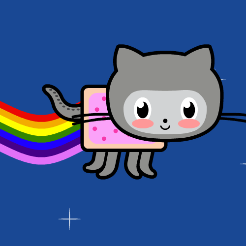
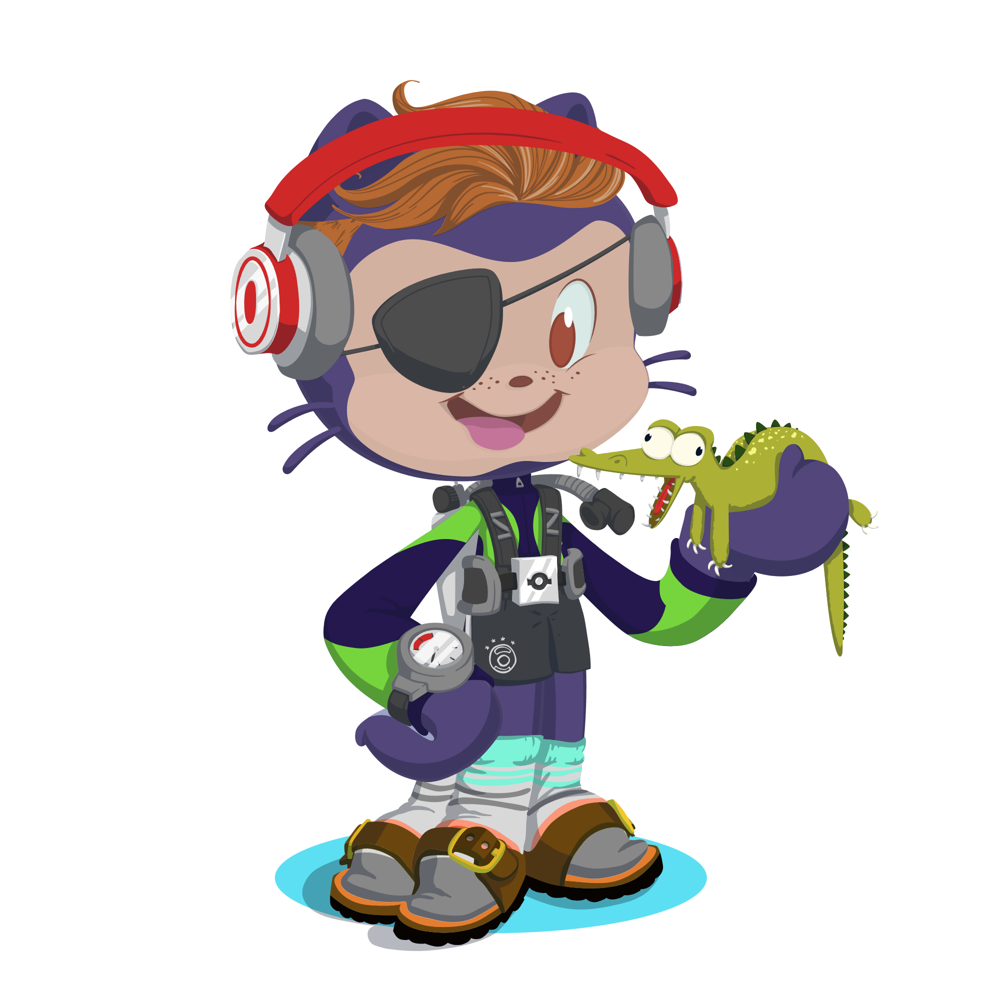

<h1>
👋¡BIENVENIDOS A MI PERFIL DE GITHUB!👋</h1>

   &nbsp

## **PRESENTACIÓN**🖼️
----

-Hola , soy ***Marco Balla Martín***😁 . Actualmente estoy cursando un grado superior de **Desarrollo de Aplicaciones Multiplataforma**🧑‍💻 en el IES Luis Vives de Leganés.

-A parte del castellano , tengo un buen nivel de **inglés** y conocimiento del **alemán**.

-En relación a mis hobbies , disfruto llendo a levantar hierros en el gimnasio🏋️‍♂️,  permite despegarme y evadirme un poco de los estudios y otras cosas del día a día ; amo el fútbol⚽🥅 , siempre veo todos los partidos de mi equipo .También  tengo un gran grupo de amig@s con los que salgo y disfruto siempre que puedo 😊🍻.

   &nbsp

## **OBJETIVOS**💹
----
-Me encanta la informática  y estoy estudiando este grado para conseguir desarrollar aplicaciones y saber trabajar en equipo para colaborar en grandes proyectos.

-Al acabar el grado me gustaría seguir formándome para aprender muchos lenguajes de programación y crear páginas web llamativas.

   &nbsp

## **TECNOLOGÍAS**⌨️
-----

    

   &nbsp

## **CONTACTO**✔️
----
 

   &nbsp

